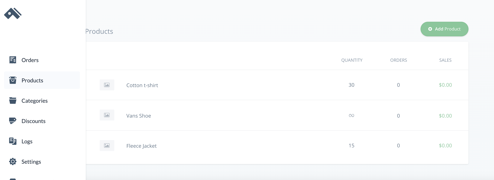

# Create a Cart with React and Three.js

This guide shows you how to set up a shopping cart using Commerce.js, React, Three.js, and React-Three-Fiber.

This guide uses the [Commerce.js](https://commercejs.com/) SDK (v2), and is a continuation of a previous guide— [Build a Product Detail page with React and Three.js](https://github.com/Andreloui5/CommerceWithThree/blob/master/README.md)

[View the live demo](INSERT LINK HERE).


## Overview

Through this project, you will:

 * See how Commerce.js enables highly customized eCommerce sites
 * Use [Three.js](https://threejs.org/) to build a scalable shopping cart with 3D elements
 * Use Commerce.js to track and

### Requirements
As with the last guide, you will need:

- A code editor/IDE of your choice
- A [Chec](https://authorize.chec.io/signup) account
- Node.js
- npm/yarn

### Prerequisites

It will help if you have some working knowledge of:
- JavaScript
- React
- Bootstrap


### Installation

In addition to the technologies used in the last guide, you will need to use FontAwesome. Insert a link to a the FontAwesome CDN in the `index.html` file of your project's `public` folder.
```html
<link rel="stylesheet" href="https://use.fontawesome.com/releases/v5.13.1/css/all.css" integrity="sha384-xxzQGERXS00kBmZW/6qxqJPyxW3UR0BPsL4c8ILaIWXva5kFi7TxkIIaMiKtqV1Q" crossorigin="anonymous">
```
You will also need to use `react-spring`, which you can install with npm.
```bash
npm i react-spring
```
### Project usage

**1. Uploading Products**

If you haven't done so already, create a [Chec](https://authorize.chec.io/signup) account. Once you're logged in, navigate to **Products**.



You'll want to add a few products to your list, just as you added the Fleece Jacket in the last guide. (Click **Add Product** and enter information into the required fields.)

The new models this guide uses can be found [here](https://sketchfab.com/3d-models/advanced-game-characters-week-2-jacket-8f211f057bb24f5db17ca659553b716b) and [here](https://sketchfab.com/3d-models/game-res-shirt-for-male-character-629d138b40054e01b82af4541e2bc16c).

Instead of adding only the name of the color option (Blue, Red, or Flax), include the hex value of that color, as well. So your variant options for  will look something like: "Blue #80CED7", "Flax #E9D985", and "Red #BF211E".

Click **Save Changes** at the bottom of the page and open your code editor.


**2. Setting up your file structure**

In addition to the files you have already created, you'll want to add six more to your components folder.
```
|--components
|  |--Cart.js
|  |--CartItem.js
|  |--FontAwesome.js
|  |--Loader.js
|  |--Navigation.js
|  |--Scene.js
```
**3. Adding CSS**

Since this guide is not primarily focused on styling, add replace the content in your styles.css folder with the following code.

<details>
<summary>Click to show css</summary>

```css
body,
html,
canvas {
  width: 100vw;
  height: 100vh;
  margin:0;
  padding:0;
  background-color: #2D3047;
  background-image: linear-gradient(147deg, #2D3047 0%, #eae6e5 74%);
}

* {
  box-sizing: border-box;
}

.sr-only {
  z-index: 1;
}
/* Item Page Styling */
.item {
  background: #fafdff;
}

h2 {
  text-align: center;
  margin-top: 50px;
}

.info {
  margin: 30px 30px 15px 0;
  padding: 30px;
}

.buttonRow {
  margin-top: 80px;
}

/* Possible Item Colors */
.colorButton {
  border-radius: 50%;
  border-style: solid;
  border-width: 1px;
  border-color:#e6e6e6 ;
  width: 50px;
  height: 50px;
  margin-right: 10px;
  /* background: linear-gradient(145deg, #e6e6e6, #ffffff); */
  box-shadow:  20px 20px 60px #d9d9d9,
             -20px -20px 60px #ffffff;
}

.addToCart{
  float:right;
  margin-top: 0px;
  border-radius: 7px;
}

/* Keeps color buttons on item page from colliding on resize */
@media screen and (max-width: 929px ) {
  .colorButton,
  .addToCart {
    margin-top: 10px;
  }
}

@media screen and (max-device-width: 575px ) {
  canvas {
    width:100%;
    height: 100%;
  }
  .info {
    margin: 30px;
    padding: 30px;
  }

}

/* Navbar Styling */
.mainNav {
  height: 70px;
}

 /* Cart Styling */
 .cart{
  position: fixed;
  top: 70px;
  right: 0;
  height: 100vh;
  background: #2D3047;
  padding: 40px;
  z-index: 100;
  overflow: scroll;
  /* min-width: 230px; */
 }

.cart p {
  color: #ffffff;
}
.cart h4 {
  color: #ffffff;
}
.cart h3 {
  color: #ffffff;
}

#cartNumber {
  color: #ffffff;
  float: right;
  margin-left: 7px;
  font-size: 15px;
}

#cartButton {
  padding: 10px 15px;
}

.cartItem {
  padding: 0;
  max-block-size: inherit;
}

.cartInfo {
  margin-top: 20px;
}

#total{
  float: right;
  margin-top: 20px;
}

#buy {
  float: right;
  border-radius: 7px;
  margin: 10px 0 80px;
}

.quantityButton{
  height: 27px;
  width: 27px;
  border-radius: 50%;
  border-style: solid;
  border-width: .1px;
  border-color:#30334c ;
  background: linear-gradient(45deg, #30334c, #292b40);
  box-shadow:  20px 20px 60px #202232, -20px -20px 60px #3a3e5c;
}

span .fas {
  color: #ffffff;
}

.fa-trash {
  float:right;
}
```
</details>

**4. Handling State for your Cart**

In the last guide, you used React's `useEffect()` hook to fetch data from `commerce` and the `useState()` hook to set the state of `products` in `App.js`. You will need to set up a few more hooks in order to properly handle the state of your cart.

First, add the following to App.js
```js
const [cart, setCart] = useState();
const [numberOfItems, setNumberOfItems] = useState("");
```
Then, you will add an additional call to `commerce` to retrieve the shoppers cart.
```js
 useEffect(() => {
    commerce.products.list().then((res) => {
      setProducts(res.data);
    });
    commerce.cart.retrieve().then((res) => {
      setCart(res);
    });
  }, []);
  ```
  Using the `retrieve()` method from `commerce` makes it possible for a shopper to add something to their cart, leave the page, and still have access to their cart when they return.

  You will also want to add a listener to `cart` so that you can update the `numberOfItems` in your cart (to display at the top right of the screen). Again, you can use the `useEffect()` hook, and place `cart` in the square brackets at the end of the hook. This updates the `numberOfItems` whenever the `cart` changes.
```js
useEffect(() => {
    cart !== undefined
      ? setNumberOfItems(cart.total_items)
      : setNumberOfItems("");
  }, [cart]);
```

Since you will be handling the state of your cart in App.js, you will also need to add handlers for adding, updating, and removing items from your cart. These handlers can then be passed down to other components via `props`.

To add products to your cart:
```js
  const addToCart = (productId, variantInfo) => {
    commerce.cart.add(productId, variantInfo).then((res) => {
      setCart(res.cart);
    });
  };
```
To update your cart, or remove an item if the user makes the quantity equal to 0:
```js
  const updateCart = (itemId, count) => {
    count === 0
      ? commerce.cart.remove(itemId).then((res) => setCart(res.cart))
      : commerce.cart.update(itemId, { quantity: count }).then((res) => {
          setCart(res.cart);
        });
  };
```
And to remove an item from the cart:
```js
  const removeItemFromCart = (itemId) => {
    commerce.cart.remove(itemId).then((res) => setCart(res.cart));
  };
```

**5.Adding a Navigation Bar**

The next step in this project is adding a navigation bar and cart icon. To begin, move to the `Navigation.js` file you added earlier. Create a new component with the following code:
```js
import React, { useState } from "react";
import { Navbar, Nav, Button } from "react-bootstrap";

function Navigation(props) {
  const [isCartOpen, setIsCartOpen] = useState(false);

  return (
    <>
      <Navbar
        bg="dark"
        variant="dark"
        sticky="top"
        className="mainNav"
      >
        <Navbar.Brand href="#home">Commerce</Navbar.Brand>
        <Nav className="mr-auto"></Nav>
        <Button
          id="cartButton"
          variant="dark"
          onClick={() =>
            isCartOpen ? setIsCartOpen(false) : setIsCartOpen(true)
          }
        ></Button>
      </Navbar>
    </>
  );
}

export default Navigation;
```
You will notice that the bootstrapped Navbar is taking advantage of `useState()` to keep track of whether the user has toggled the cart open or closed.

To set up the cart icon for your button, create a functional component in `FontAwesome.js`.
```js
import React from "react";

const FontAwesome = ({ isCartOpen, numberOfItems }) => {
  return isCartOpen ? (
    <i
      className="fas fa-times"
      style={{ fontSize: "25px", padding: "12px" }}
    ></i>
  ) : (
    <div style={{ marginTop: "10px" }}>
      <i className="fas fa-shopping-cart" style={{ fontSize: "25px" }}></i>
      {numberOfItems === 0 ? <></> : <p id="cartNumber">{numberOfItems}</p>}
    </div>
  );
};
export default FontAwesome;
```
This components uses conditional logic to display only an icon if the user's cart is empty. If the user has added items to his or her cart, however, the number of items in the cart is displayed alongside the cart icon

Now, import `FontAwesome` into `Navigation.js` and place it inside `<Button>`.
```js
  <FontAwesome
    isCartOpen={isCartOpen}
    numberOfItems={props.numberOfItems}
  />
```

**6. Making the Cart Itself**

Next, turn your attention to `Cart.js`. Import `useSpring` and `animated` from `react-spring`. Then, instead of returning a regular `<div>`, return an `<animated.div>`. This allows react spring to animate the component. You will also need to specify the parameters of the animation. (If you want to know more about what this animation library can do, check out [react spring](https://www.react-spring.io/)).

For this guide, use the hook `useSpring()`. This allows you to smoothly animate styling between the cart's open or closed states.
```js
const showCart = useSpring(
    props.isCartOpen
      ? {
          width: "50%",
          background: "#2D3047",
          opacity: 1,
        }
      : {
          width: "0%",
          background: "#eae6e5",
          opacity: 0,
        }
  );
```

The return value itself is a nested conditional statement. The first handles the undefined state that comes while waiting for your call to commerce to complete. The second conditional toggles the cart's display between a message (if the cart is empty) and the cart's contents (once the user has added an item).

`Commerce` makes it easy to map through the `line_items` that a user adds to the `cart`. For this guide, you can use the following code to set up your cart:
```js
<>
  {props.cart.line_items.map((item) => (
    <CartItem
      key={item.id}
      uniqueId={item.product_id}
      updateCart={props.updateCart}
      removeItemFromCart={props.removeItemFromCart}
      quantity={item.quantity}
      {...item}
    />
  ))}
  <Row>
    <Col>
      <h3 id="total">
        Total: {props.cart.subtotal.formatted_with_symbol}
      </h3>
    </Col>
  </Row>
  <Row>
    <Col>
      <a href={props.cart.hosted_checkout_url}>
        <Button id="buy" variant="primary">
          Buy Now
        </Button>
      </a>
    </Col>
  </Row>
</>
```
All together `Cart.js` should look something like this:

<details>
<summary>Click to show `Cart.js`</summary>

```js
import React from "react";
import { useSpring, animated } from "react-spring";
import { Row, Col, Button } from "react-bootstrap";
import CartItem from "./CartItem";
import "./style.css";

function Cart(props) {
  const showCart = useSpring(
    props.isCartOpen
      ? {
          width: "50%",
          background: "#2D3047",
          opacity: 1,
        }
      : {
          width: "0%",
          background: "#eae6e5",
          opacity: 0,
        }
  );

  return (
    <animated.div className="cart" style={showCart}>
      {props.cart !== undefined ? (
        <div>
          {props.cart.line_items.length === 0 ? (
            <h3 style={{ textAlign: "center" }}>
              Your cart is currently empty.
            </h3>
          ) : (
            <>
              {props.cart.line_items.map((item) => (
                <CartItem
                  key={item.id}
                  uniqueId={item.product_id}
                  updateCart={props.updateCart}
                  removeItemFromCart={props.removeItemFromCart}
                  quantity={item.quantity}
                  {...item}
                />
              ))}
              <Row>
                <Col>
                  <h3 id="total">
                    Total: {props.cart.subtotal.formatted_with_symbol}
                  </h3>
                </Col>
              </Row>
              <Row>
                <Col>
                  <a href={props.cart.hosted_checkout_url}>
                    <Button id="buy" variant="primary">
                      Buy Now
                    </Button>
                  </a>
                </Col>
              </Row>
            </>
          )}
        </div>
      ) : (
        <></>
      )}
    </animated.div>
  );
}

export default Cart;
```
</details>